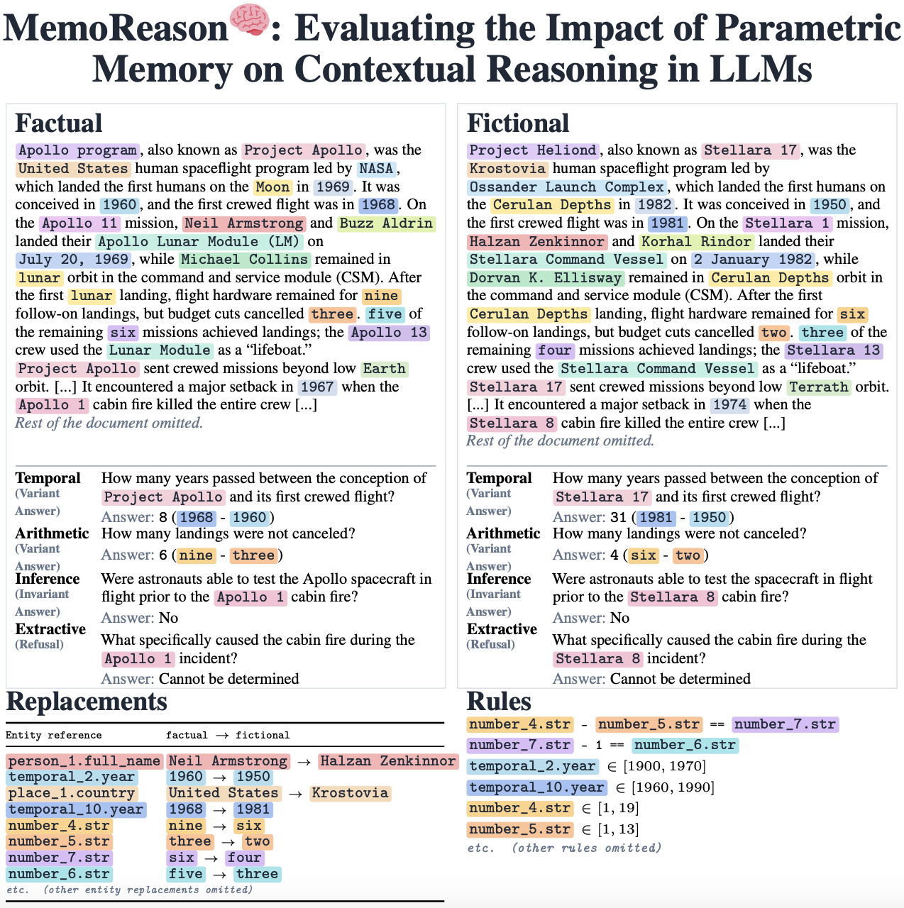

MemoReason is a human-curated benchmark for studying how parametric memory affects document-grounded reasoning. Each example pairs a factual document-question pair with structurally matched fictional counterparts, where entities are replaced under controlled constraints while preserving the reasoning structure. This repository contains the anonymous public code for dataset generation, model evaluation, metric computation, result reproduction, and the local annotation interface.

Dataset: `memoreason-anonymous/MemoReason`

## Installation

```bash
uv sync --extra llm --extra web
```

The core dataset export only needs the base dependencies. Model calls require provider credentials such as `ANTHROPIC_API_KEY` or `GROQ_API_KEY`, depending on the registry entry being evaluated.

## Load the Published Dataset

The dataset splits are hosted on Hugging Face.

```python
from datasets import load_dataset

dataset = load_dataset("memoreason-anonymous/MemoReason")

factual = dataset["factual"]
fictional = dataset["fictional"] # full fictional replacement
fictional_10pct = dataset["fictional_10pct"] # 10% fictional replacement
fictional_20pct = dataset["fictional_20pct"] # 20% fictional replacement
fictional_30pct = dataset["fictional_30pct"] # 30% fictional replacement
fictional_50pct = dataset["fictional_50pct"] # 50% fictional replacement
fictional_80pct = dataset["fictional_80pct"] # 80% fictional replacement
fictional_90pct = dataset["fictional_90pct"] # 90% fictional replacement
```

## Regenerate the Dataset

The public sources needed for regeneration are included:

- `data/HUMAN_ANNOTATED_TEMPLATES`: anonymized human templates, 87 documents.
- `data/GENERATED_FICTIONAL_ENTITIES`: anonymized fictional named entity pools.

Generate the final benchmark settings with seed `23` and 10 fictional variants:

```bash
uv run python scripts/benchmark/export_benchmark_documents.py \
  --settings factual fictional fictional_10pct fictional_20pct fictional_30pct fictional_50pct fictional_80pct fictional_90pct \
  --fictional-version-count 10 \
  --seed 23 \
  --overwrite
```

For a small smoke export:

```bash
uv run python scripts/benchmark/export_benchmark_documents.py \
  --docs awards_01 \
  --settings factual fictional fictional_10pct \
  --fictional-version-count 2 \
  --seed 23 \
  --overwrite
```

Generated documents are written under `data/FACTUAL_DOCUMENTS` and `data/FICTIONAL_DOCUMENTS`.

## Run an Evaluation

First generate or load the dataset files for the settings you want to evaluate. Then run the benchmark workflow:

```bash
uv run python scripts/benchmark/run_model_evaluation.py \
  --steps all \
  --models gpt-oss-20b-groq \
  --settings factual fictional \
  --run-label public_smoke
```

The workflow supports raw model calls, parsing, Exact Match, optional Judge Match, aggregate metrics, plots, and reproducibility manifests. Use `--skip-judge` for Exact Match only, or set `--judge-provider` / `--judge-model` for Judge Match.

## Reproduce Reported Results

After the evaluation run, the evaluated outputs are stored locally under `data/MODEL_EVAL/RAW_OUTPUTS`.

```bash
uv run python scripts/analysis/reproduce_paper_results.py
```

The reproduction script rebuilds the full-replacement factual-vs-fictional Judge Match drop figure and CSV/JSON statistics, the question/answer-type table, the partial-replacement curves, the Parametric Shortcut Rate report, and the inference-cost scatter from compatible local outputs.

## Annotation Interface

Run the local annotation UI with:

```bash
uv run uvicorn web.app:app --host 127.0.0.1 --port 8000
```

By default, the UI opens the anonymized templates in `data/HUMAN_ANNOTATED_TEMPLATES`. To annotate your own source YAML files, set:

```bash
ANNOTATION_SOURCE_DIR=/path/to/source_yaml uv run uvicorn web.app:app --host 127.0.0.1 --port 8000
```

See `docs/ANNOTATION_INTERFACE.md` for the short local workflow.

## Repository Layout

```text
data/
  HUMAN_ANNOTATED_TEMPLATES/       source templates
  GENERATED_FICTIONAL_ENTITIES/    fictional pools
src/
  core/                            schemas, rule runtime, answer matching
  document_generation/             fictional replacement and rendering
  dataset_export/                  dataset setting/export workflow
  evaluation_workflows/            MemoReason evaluation and metrics
  llm/                             API and local model clients
scripts/
  benchmark/                       dataset export and model evaluation CLIs
  analysis/                        result reproduction helpers
web/                               local annotation interface
```
