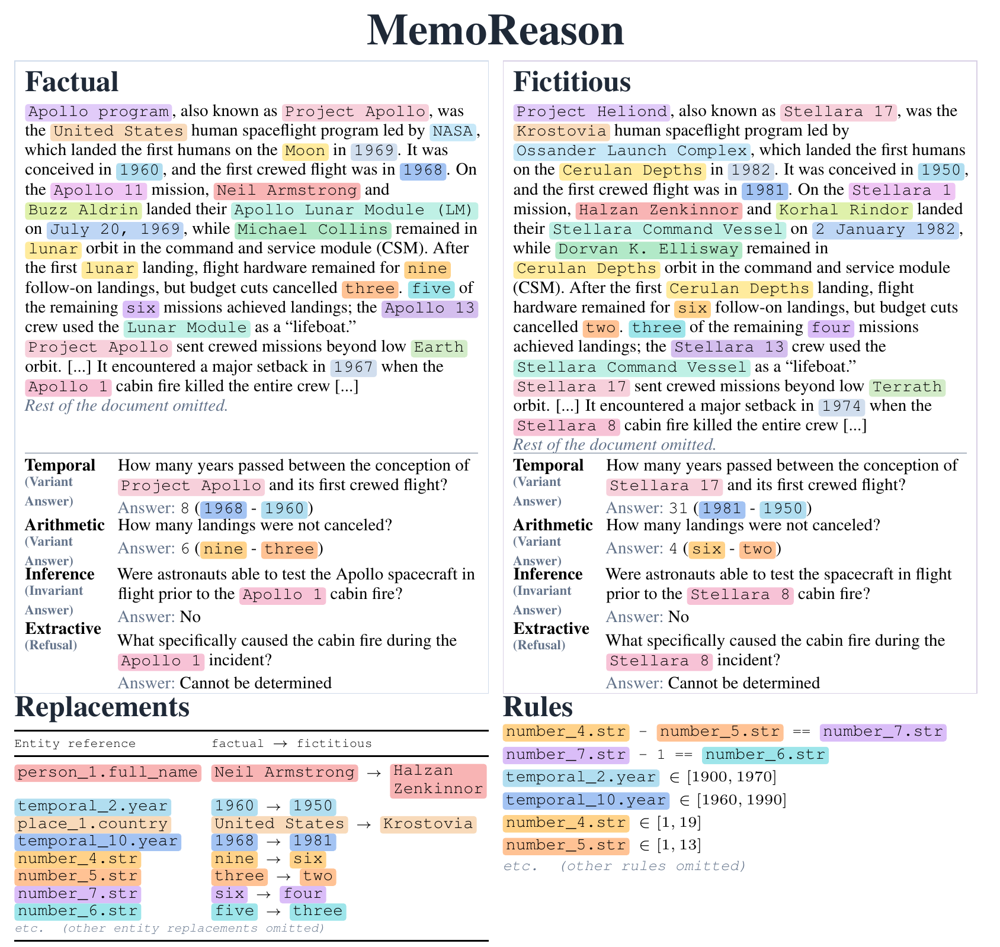

# MemoReason

MemoReason studies how entity familiarity affects document-grounded reasoning.
Factual passages are paired with fictitious variants that preserve task structure
and specified reasoning operations. This repository contains 1,200 annotated
document–question–answer templates, entity pools, and code for generation,
evaluation, and annotation.

[Dataset and subset descriptions](https://huggingface.co/datasets/zineddine/MemoReason)

[Reproduce each paper figure and table](REPRODUCE.md)

## Installation

Requires Python 3.11 and `uv`.

```sh
uv sync --extra web
```

## Generate the dataset

```sh
uv run python scripts/dataset.py --output data/generated
```

Generates all ten settings from the supplied templates and entity pools, on CPU
without model calls. Use a new output directory each time.

## Evaluate a model

Install the model dependencies and configure the appropriate provider credentials
or local model weights. For example, to run exact-match evaluation:

```sh
uv sync --extra llm
uv run python scripts/model_evaluation/generate_parse_and_score_model_answers.py \
  --steps all --models gpt-oss-20b-groq --settings factual fictional \
  --factual-documents-dir data/generated/FACTUAL_DOCUMENTS \
  --fictional-documents-dir data/generated/FICTIONAL_DOCUMENTS \
  --model-eval-dir output/gpt-oss-20b --skip-judge --allow-model-execution
```

For judge matching, replace `--skip-judge` with explicit `--judge-provider` and
`--judge-model` values. See `--help` for additional options. Benchmark reference
answers are applied automatically; model outputs and results are not bundled.

## Annotation interface

```sh
export DEFAULT_ADMIN_PASSWORD='choose-a-local-password'
uv run --extra web uvicorn web.app:app --host 127.0.0.1 --port 8000
```

Open `http://127.0.0.1:8000` and log in as `admin`. Local edits are stored in
`web/data/`, separately from the source templates.

## Tests

```sh
uv run --extra web pytest -q
```